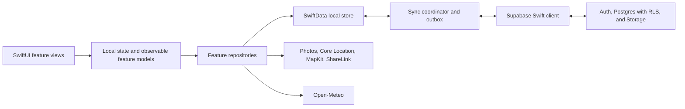

# Reel Records — Implementation Plan

> High-level architecture and phased delivery sequence. This is an implementation roadmap, not a
> replacement for `PRD.md`, `user-stories.md`, `design-system.md`, or `decisions.md`.

**Status:** Approved for detailed planning · 2026-07-19  
**Delivery method:** Vertical slices · backend → local persistence/sync → native UI → device → TestFlight

## 1. Objective

Build Reel Records as a sequence of small, deployable capabilities. Each phase must deliver one
user-visible outcome through the entire system before the next phase begins. The first phase is a
tracer bullet that validates the riskiest path: signing, TestFlight, authentication, RLS, local-first
persistence, synchronization, and recovery on another device.

This plan intentionally avoids horizontal phases such as “build the full schema,” “build all shared
components,” or “build every screen.” Schema, sync behavior, reusable UI, and tests grow only when a
vertical slice needs them.

## 2. Architecture

### 2.1 Pattern

Use a **local-first, feature-oriented SwiftUI architecture**:

- **SwiftUI + Observation** for presentation and state. Use local value state by default and small
  `@Observable` feature models only for screens coordinating asynchronous or multi-step behavior.
- **Feature repositories** provide the application-facing data API. Views do not call Supabase or
  SwiftData directly for business operations.
- **SwiftData** is the on-device source read by the authenticated UI. User mutations commit locally
  first and do not wait for the network.
- An explicit **outbox + sync coordinator** pushes pending mutations and pulls remote changes.
- **Supabase** provides Auth, Postgres, Row-Level Security, and Storage through `supabase-swift`.
- Supabase transport DTOs remain separate from SwiftData persistence models and domain values.
- Apple frameworks provide navigation, photos, location, maps, sharing, and accessibility. Avoid
  third-party dependencies unless a later phase demonstrates a concrete need.

### 2.2 App shell and dependency ownership

- Root state chooses the unauthenticated flow or authenticated app shell.
- The authenticated shell uses the fixed five-tab structure: Home / Log / Add / Map / You.
- Each tab owns its navigation path. Add Catch and Catch Detail use enum-driven presentations rather
  than multiple independent Boolean flags.
- App-level services—auth session, repositories, sync coordinator, connectivity, and configuration—are
  installed once at the root. Feature-local state is passed explicitly.
- Start with one app target plus unit and UI-test targets. Organize source by feature; do not create
  packages or framework targets until there is demonstrated pressure to do so.
- Encode only the foundational design tokens needed in Phase 1. Add reusable components as their first
  real screen requires them.

### 2.3 Local-first data contract

- Record IDs are client-generated UUIDs so records can be created offline.
- Local rows are scoped to the authenticated owner and have explicit pending, syncing, synced, failed,
  and conflict states. Failure preserves the local record and exposes a retry path.
- The app UI reads local state; remote results are merged into local state.
- An already-authenticated user can log and browse offline. First signup/login requires a network.
- Account changes must never expose the previous account's local data.
- Photo files are written locally first; their uploads are separate queued operations.
- Remote deletions use retained `deleted_at` tombstones so another device can observe them. Catch
  updates and tombstones use optimistic versions; divergent edits preserve the local draft and require
  an explicit keep-mine retry. Sign-out is blocked while any mutation or conflict remains queued. See
  the 2026-07-19 Phase 02 sync decision in `decisions.md`.

### 2.4 Backend and environments

- All schema changes are version-controlled Supabase migrations.
- Every client-accessible table has RLS enabled and least-privilege grants. Policies are tested with at
  least two users.
- The iOS client contains only the Supabase project URL and publishable client key. A service-role key
  is never included in the app.
- Target architecture: Debug builds use a local/separate development Supabase environment and
  TestFlight uses hosted beta. During the Phase 01 tracer bullet, Debug and Beta intentionally inherit
  the same hosted beta endpoint from `Config/Base.xcconfig`; split them before destructive development
  or broader beta work. A separate production environment can wait until public release is contemplated.
- Configuration is build-setting based and excluded from business logic.

## 3. Vertical-slice definition of done

A phase is complete only when all applicable checks pass:

1. Product behavior and acceptance criteria are linked to the relevant user stories.
2. Database migrations, grants, RLS, and Storage policies are applied and tested.
3. Local persistence and sync behavior work through relaunch and connectivity changes.
4. The native UI includes loading, empty, offline, error, and no-permission states required by the slice.
5. Unit tests cover pure behavior; integration tests cover repository/sync and RLS boundaries.
6. The feature is exercised on a real supported iPhone, including the slice's offline path.
7. A fresh install or second-device check verifies remote recovery when the slice stores user data.
8. Accessibility labels, Dynamic Type behavior, and privacy permission text are checked where relevant.
9. The build is deployable through TestFlight, and the phase plan records the build tested.
10. Planning and decision docs reflect the actual result before the phase is closed.

For the uninterrupted simulator-based development loop requested on 2026-07-19, Phases 02–10 may
close after their local migration, persistence, sync, UI, and Simulator gates pass. Hosted migration,
signed TestFlight, physical-device offline/reconnect, and final fresh-device recovery are consolidated
in Phase 11 against the final included schema. A local phase closeout must state those deferred gates;
it must not imply that a new hosted build or physical acceptance run occurred.

## 4. Phase sequence

| Phase | Capability | Principal stories | Deployment outcome |
|---|---|---|---|
| 01 | Tracer bullet | A1, B1, E1, E2, E5 | TestFlight user can save a minimal catch offline and recover it remotely |
| 02 | Core Catch CRUD | A1, A3, A6 | Core text/measurement catch can be added, edited, deleted, and synchronized |
| 03 | Logbook and Catch Detail | B1–B5 | Catches are browsable, searchable, sortable, and viewable in detail |
| 04 | Photos | A2, B5, E5 | Multiple photos save locally, upload, reorder, and recover on another device |
| 05 | Location and Map | A5, D1, D2 | GPS/manual coordinates flow from logging to real MapKit pins |
| 06 | Conditions | A4 (conditions) | Weather and water data work manually offline and enrich online |
| 07 | Dashboard | C1–C3 | Stored catches produce useful home-screen summaries and navigation |
| 08 | Tackle Box | A4 (gear), A7, F1–F3 | Offline-capable tackle catalog feeds structured catch selection |
| 09 | Profile and settings | C4, E3, E6 | User identity is editable and safely synchronized |
| 10 | Bookmark and share | B6 | Saved filtering and private per-catch image sharing work end to end |
| 11 | Beta hardening | Cross-cutting | Multi-device, failure recovery, accessibility, privacy, and external beta are ready |

Detailed plans: [`implementation-phases/`](implementation-phases/README.md).

### 4.1 Release-scope gate

Phases 01–07 establish the P0 core release candidate. Phases 08–10 are the full target sequence but are
P1 and may be deferred individually before the first external beta. After Phase 07, record which P1
phases are included in that beta. Phase 11 hardens every included phase; it does not require deferred P1
features to be implemented. Any account-lifecycle behavior required for external distribution must be
assigned and completed before Phase 11 begins rather than introduced during hardening.

## 5. Dependency rules

- A later phase may use completed behavior but must not silently expand an earlier phase's contract.
- A newly discovered cross-cutting requirement is added to the earliest not-yet-complete phase that can
  validate it safely. Completed phases receive a targeted regression update if necessary.
- Every schema expansion is additive unless a migration and rollback/recovery path are explicitly tested.
- Phase 1 establishes the minimum architecture; it does not need the final generalized sync engine.
  Later capabilities must extend the same local-first boundary rather than bypass it.
- P1 features remain after the P0 core path unless they are necessary to validate infrastructure.
- Notifications and full-logbook export remain outside this sequence unless separately specified.

## 6. Pre-scaffold confirmation gate

**Gate status:** Satisfied on 2026-07-19; see the Phase 01 identity/environment/session decision in
`decisions.md`.

Before Phase 1 scaffolding begins, confirm and record:

- bundle identifier, app display name, Apple team, and TestFlight app record ownership;
- hosted beta Supabase project and environment configuration approach;
- Supabase signup email-confirmation behavior consistent with “signup → straight in”;
- Phase 1 account/session behavior while offline;
- minimum sign-out behavior when a locally created Catch has not synchronized;
- the initial test phone, iOS version, and internal-TestFlight tester account;
- whether local Supabase development is required immediately or hosted development is acceptable for
  the first tracer build.

No application or backend code should be generated until this gate and the Phase 1 plan are confirmed.

## 7. Plan maintenance

- Each phase file owns its scope, sequence, verification evidence, and closeout status.
- Consequential technical choices are recorded in `decisions.md` before implementation.
- If product behavior changes, update the PRD/user story first, then revise the affected phase plans.
- Mark phases complete only from evidence: migrations, tests, device behavior, and TestFlight build—not
  from implementation intent.
